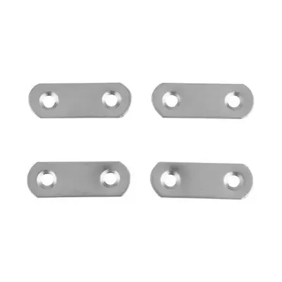

# Assembly guide

1.บัดกรีโมดูลวัดระยะตามสีดังรูป หรือสามารถดูตามพอร์ตบนบอร์ดขาวกรณีสีไม่ตรงกัน โดนพอร์ต EXT บนบอร์ดขาวหมายถึง XSHUT บนโมดูลวัดระยะ

2. ติดตั้งกับตัวหุ่นดังรูปโดยใช้น็อต M3 x 12 สำหรับตัววัดระยะตำแหน่งกลาง และใช้น็อตสั้นสำหรับตัววัดระยะตำแหน่งข้าง

3. บัดกรีเซ็นเซอร์ตรวจจับเส้นขาวดำตามรูป

4. ติดตั้งตัวยึดแบตใช้น็อตตัวยาวสุด โดยให้สายจากเซ็นเซอร์วัดระยะผ่านช่องลอดข้างตัวน็อตยึดดังรูป

5. บัดกรีสายมอเตอร์ให้ใช้ขั้ว + เป็นขั้วสีแดง ขั้ว - เป็นขั้วสีดำ 
ระวังอย่าให้มีตะกั่วบัดกรีล้นออกมาจากความสูงเดิมของขั้วมอเตอร์ 
โดยให้บัดกรีโดยการวางสายมอเตอร์ด้านข้างขั้วแทนที่จะบัดกรีด้านบน

6. ยึดล้อเข้ากับมอเตอร์ดังรูป ในการนำน็อตตัวเมียเข้าไปฝังใน 3d print อาจต้องใช้ไขควงตัวเมียขยายช่อง 3d print ให้กว้างขึ้นถ้าจำเป็น

7. ยึดล้อเข้ากับตัวยึดล้อแบบสั้นดังรูป

8. ใส่น็อตตัวสั้นสำหรับยึดบอร์ดขาวดังรูป

9. กรณีตต้องการเพิ่มน้ำหนัก ให้ใช้น้ำหนักยึดกับช่องตรงกลางหน้ามอเตอร์คู่หลังดังรูป

10. ประกอบมอเตอร์หลังดังรูป โดยให้สายไฟออกมาทางด้านหลัง

11. หากบัดกรีบอร์ดขาวเรียบร้อย ให้ติดตั้งโดยจะได้ผลลัพธ์ดังรูป ให้ตรวจสอบสีของสายและไฟเลี้ยงกับ GND ให้ตรงกัน
สังเกตว่าสาย RCIN จะมีสีแดงตรงกลางดังรูป ส่วนสายเซ็นเซอร์จะมีสีแดงริมสุดครับ

สาย เซ็นเซอร์ตรวจจับเส้นต่อพอร์ต BottomS
สาย RC Remote ตรวจจับเส้นต่อพอร์ต RCIN
สาย เซ็นเซอร์วัดระยะด้านซ้ายต่อพอร์ต S_FLEFT
สาย เซ็นเซอร์วัดระยะด้านกลางต่อพอร์ต S_FMID
สาย เซ็นเซอร์วัดระยะด้านขวาต่อพอร์ต S_FRIGHT
พอร์ต S_LEFT กับ S_RIGHT ปล่อยว่างไว้

พร้อมที่จะอัพโหลดโปรแกรมและใช้งาน🎉
  

# Library

ดาวน์โหลดผ่าน Library Manager บน Arduino IDE โดยค้นหาชื่อ Library ดังต่อไปนี้
ModuleMoreSumoV2

หรือ Link:
https://github.com/fxprime/ModuleMoreSumoV2 

# Part Link

## Battery
Battery 7.4V 1500mAh JST

ตัวอย่าง 

Link:

## Remote Control

เลือก RC Remote ที่ใช้ ppm ในการส่งข้อมูลผ่านสายสัญญาณช่องเดียวเช่น

Link:

## Lipo Band

Link:

## น้ำหนักถ่วง

สเตนเลสแผ่นเจาะรู 2 รู 

Link: 
[Here](https://www.thaiwatsadu.com/th/product/%E0%B8%AA%E0%B9%80%E0%B8%95%E0%B8%99%E0%B9%80%E0%B8%A5%E0%B8%AA%E0%B9%81%E0%B8%9C%E0%B9%88%E0%B8%99%E0%B9%80%E0%B8%88%E0%B8%B2%E0%B8%B0%E0%B8%A3%E0%B8%B9-2-%E0%B8%A3%E0%B8%B9-GIANT-KINGKONG-%E0%B8%A3%E0%B8%B8%E0%B9%88%E0%B8%99-WTL-1-044-5-%E0%B8%82%E0%B8%99%E0%B8%B2%E0%B8%94-50-x-16-%E0%B8%A1%E0%B8%A1-(%E0%B9%81%E0%B8%9E%E0%B9%87%E0%B8%84-4-%E0%B8%8A%E0%B8%B4%E0%B9%89%E0%B8%99)-%E0%B8%AA%E0%B8%B5%E0%B8%AA%E0%B9%80%E0%B8%95%E0%B8%99%E0%B9%80%E0%B8%A5%E0%B8%AA-60314528?gad_source=1&gclid=CjwKCAjw7s20BhBFEiwABVIMrUIREBuVhTIIMloao0GnJSOXgLDFsYJgrldEd55GVOz_cJHJUiipRRoCUXgQAvD_BwE)
